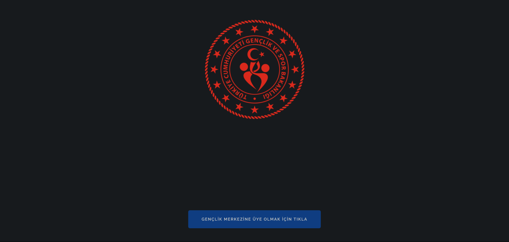
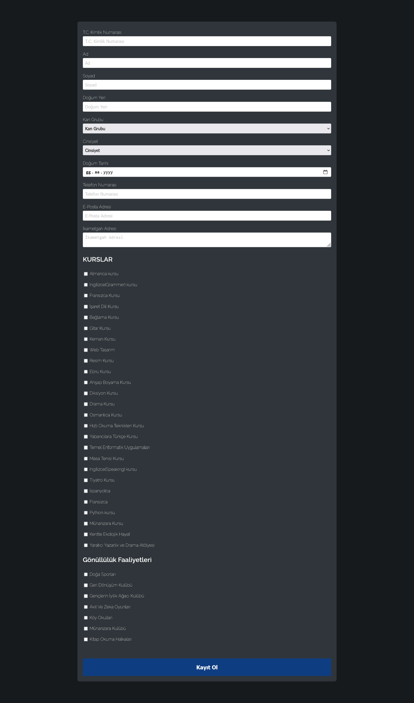
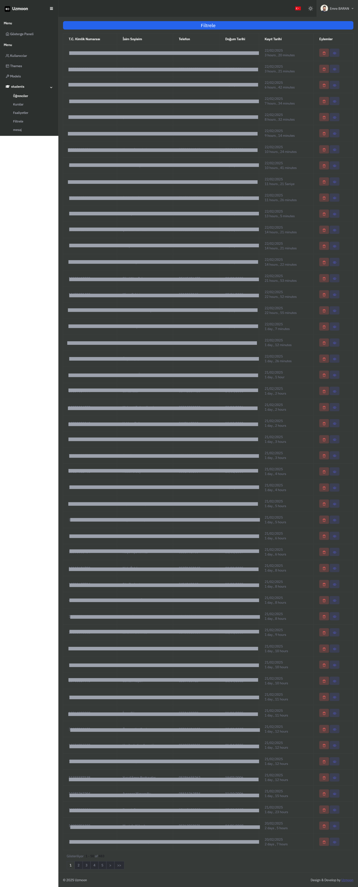
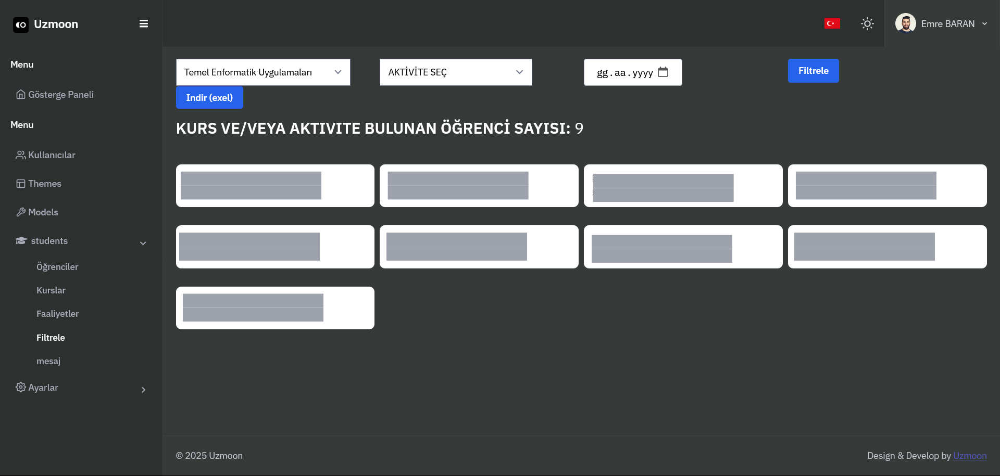

# Gençofis Registration Application

Gençofis is a registration application used by the Muğla Youth and Sports Office. This application allows users to register for various courses and activities provided by the office.

## Features

- User Registration:
  - Collects user information such as:
    - T.C. Identity Number (11-digit)
    - Name
    - Surname
    - Birthplace
    - Blood Type
    - Gender
    - Date of Birth
    - Phone Number
    - Email Address
    - Residential Address
  - Allows selection of up to 5 courses or activities from a list.

- Admin Panel:
  - Report Page:
    - Displays total number of users.
    - Shows how many users registered in one day and one week.
    - Displays the total number of courses and activities.

  - Students Page:
    - Lists registered students with their details.
    - Allows deletion of student records.

  - Courses Page:
    - Displays existing courses.
    - Allows adding and deleting courses.

  - Activities Page:
    - Similar to the courses page, allows adding, deleting, and updating activities.

  - Filter Section:
    - Allows filtering students based on course registration.
    - Users can view students registered for a specific course and set a date filter to see registrations after a specific date.

## Technologies Used

- HTML
- CSS
- PHP
- Tailwind CSS
- PHPMyAdmin (for database management)

## Screenshots

## Installation

To be implemented in the same way as the MuglaBurada project.

## Author

- Nurullah Arnus
- Email: nurullaharnus8@gmail.com

---

This project is still ongoing and under development.
